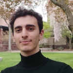

+++
+++

## Faculty

 <!-- begin columns block -->

 __[Nikos Vasilakis](https://nikos.vasilak.is/)__ \
Building transition paths toward secure multi-scale distributed enviroments.

[E-mail](mailto:nikos@vasilak.is) | [Github](http://github.com/nvasilakis) | [Twitter](http://twitter.com/nvasilakis)

<--->


## Administrative Assistant

 <!-- begin columns block -->

 __Dawn T. Reed__
  

[E-mail](mailto:dtreed@cs.brown.edu)

<--->


## Ph.D. Students
 <!-- begin columns block -->
 
 __[Yizheng Xie](https://yizhengx.github.io/)__\
Enjoys working at the intersection of systems, software, and automation.

[E-mail](mailto:yizhengx@brown.edu) | [Github](http://github.com/yizhengx)

<--->
 
__[Oğuzhan Çölkesen](https://www.oguzhancolkesen.com)__\
Interested in parallel and distributed systems, as well as their optimization.

[E-mail](mailto:oguzhan@brown.edu) | [Github](http://github.com/ocolkesen)



## M.Sc. Students

 <!-- begin columns block -->

 __[Zhicheng Huang](https://huangworld.github.io/)__\
Exploring the interface between systems and software engineering.

[E-mail](mailto:zhicheng_huang@brown.edu) | [Github](http://github.com/huangworld)

<--->



## Undergaduate Students

 <!-- begin columns block -->
 
__[Anirudh Narsipur](https://www.anarsipur.com/)__\
Towards type systems for language-angostic composition of black-box software components.

[E-mail](mailto:anirudh_narsipur@brown.edu) | [Github](http://github.com/AnirudhNarsipur)

 
 __[Julian Dai](https://jdai1.github.io/)__\
Solving the scalability challenges of secure regeneration for real-world ecosystems.

[E-mail](mailto:julian_dai@brown.edu) | [Github](http://github.com/jdai1)

 
 __[Seth Sabar](https://www.linkedin.com/in/sethsabar/)__\
Working on  Bash-compliant PaSh and an associated library, libbash.

[E-mail](mailto:seth_sabar@brown.edu) | [Github](http://github.com/sethsabar) 

<--->
 
 __[Christina Stepin](https://www.linkedin.com/in/christinastepin/)__\
Working on a distributed multidimensional store for dynamic objects.

[E-mail](mailto:christina_stepin@brown.edu) | [Github](http://github.com/cstepin)

 
__[Seong-Heon Jung](https://forthoney.github.io/)__\
Automatic compilation of shell scripts into Airflow DAGs.

[E-mail](mailto:seong-heon_jung@brown.edu) | [Github](http://github.com/forthoney)



## Visiting Students

 <!-- begin columns block -->
 
 __[Georgios Liargkovas](https://gliargovas.github.io/)__\
Enabling dynamic system adaptability to varying performance demands.

[E-mail](mailto:gliargovas@aueb.gr) | [Github](http://github.com/gliargovas) 

 
  __[Nikos Pagonas](https://nikpag.github.io/)__\
Working on parallel and distributed systems, with emphasis on serverless computing.

[E-mail](mailto:nikospagonas00@gmail.com) | [Github](http://github.com/nikpag)

<--->
 
 __[Grigoris Ntousakis](https://www.ntousakis.com/)__\
Reimagining third-party library and package ecosystems.

[E-mail](mailto:gntousakis@tuc.gr) | [Github](http://github.com/GNtousakis)



## Alumni

[Rutvik Saptarshi](https://www.linkedin.com/in/rutvik-s/) (M.Sc., 2023, now at InterSystems)\
[Felix Stutz](https://fstutz.pages.mpi-sws.org/felix-stutz/) (Ph.D. visit, 2022, now at Max Planck Institute for Software Systems)\
[Tammam Mustafa](https://www.linkedin.com/in/tammam-mustafa-884b22137) (UROP and M.Eng., 2021-2022, now at Google)\
[Veit Heller](https://veitheller.de) (Engineer, 2021, now at feenk/consulting)\
[Dimitris Karnikis](https://dkarnik.is) (M.Sc., 2020-2021, now at Bang and Olufsen)\
[Alizee Schoen](https://www.linkedin.com/in/alizee-schoen/) (UROP, 2020-2021, now at Square)\
[Achilles Benetopoulos](https://users.soe.ucsc.edu/~abenetop/) (Engineer, 2020, now at UCSC)\
[Lazar Cvetković](https://systems.ethz.ch/people/profile.MjkzNzEw.TGlzdC8zODg4LDEyOTU2NDI2OTI=.html) (B.Sc., 2019-2020, now at ETH Zurich)\
[Pranjal Goel](https://www.linkedin.com/in/pranjal-goel) (UROP, 2018-2019, now at Goldman Sachs)\
[Yash Palkhiwala](https://www.linkedin.com/in/yash-palkhiwala) (UROP, 2017-2019, now at Flatiron Health)\
[Arjun Dixit](https://janbielak.com/) (High School, 2021, now at CMU)\
[Jan Bielak](https://janbielak.com/) (High School, 2021, now at Nvidia)
